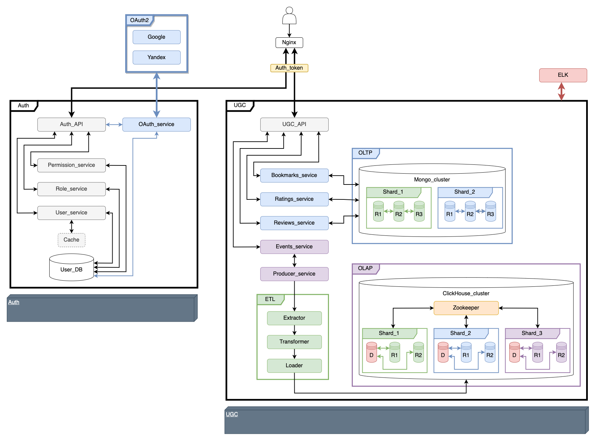

[](https://github.com/GA10v/ugc_sprint_1/actions/workflows/checks.yml)

# UGC API

Сервис для хранения аналитической информации и UGC, написанный с использованием библиотеки FastAPI, брокера сообщений Apache Kafka, баз данных ClickHouse и MongoDB. Дополнительно, для выбора БД было проведено исследование производительности баз ClickHouse, MongoDB и Vertica.

## Схема проекта



## Работа с проектом

Для работы с сервисом UGC необходимо получить access_token в сервисе [Auth](https://github.com/GA10v/Auth_sprint_2)

### Запуск приложения UGC локально
1. Установить зависимости командой
    ```$ poetry install```
2. Создать файл конфигурации ```.env``` в корне проекта и заполнить его согласно ```example.env ```
3. Для запуска контейнеров кластера ClickHouse см. [README](./ch_conf/README.md)
4. Для запуска контейнеров кластера MongoDB см. [README](./mongo_cnf/README.md)
5. Cервис ETL запускается командой
    ```$ python3 etl/src/main.py```
6. Сервис UGC запускается командой
    ```$ python3 ugc/src/main.py```
7. Перейти к документации по url: ```http://localhost:8001/api/openapi```


### Запуск приложения в docker
1. Создать файл конфигурации ```.env``` в корне проекта и заполнить его согласно ```example.env ```
2. Запустить контейнер командой
    ```$ docker-compose -f docker-compose.prod.yml up -d --build ```
3. Перейти к документации по url: ```http://localhost:8001/api/openapi```

### Запуск тестов
1. Создать файл конфигурации ```.env``` в корне проекта и заполнить его согласно ```example.env ```
2. Запустить контейнер командой
    ```$ docker-compose -f docker-compose.test.yml up -d --build```